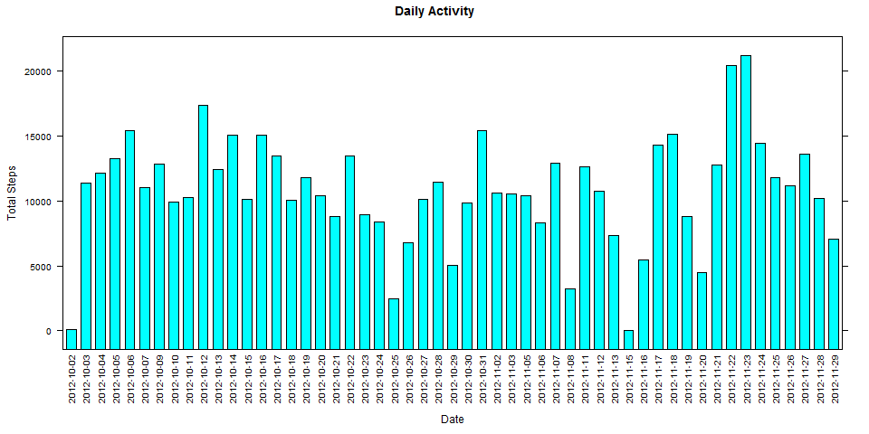
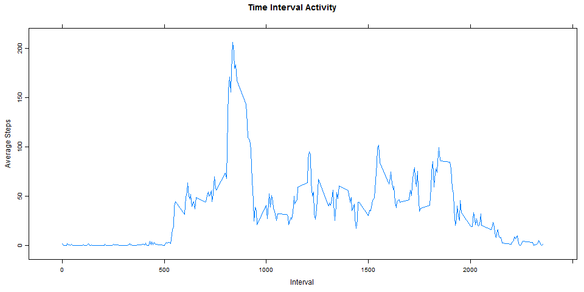
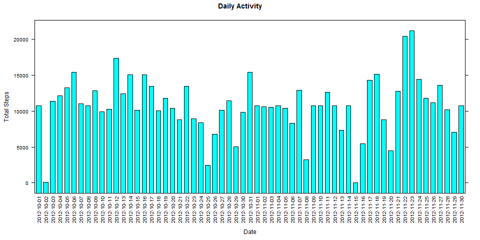
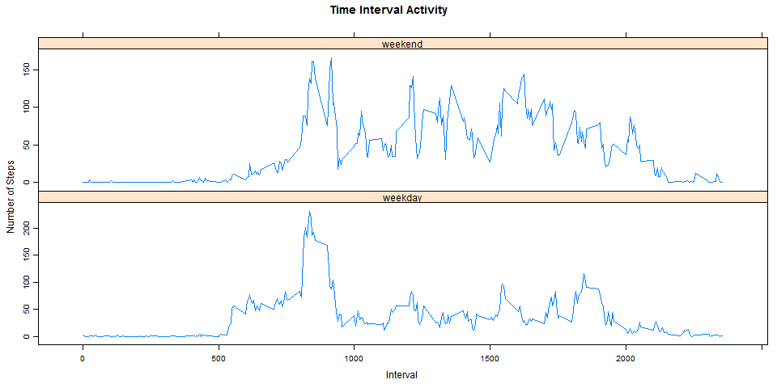

# Reproducible Research: Peer Assessment 1

## Prepare for analyses
```{r }
library(knitr)
library(markdown)
library(reshape)
library(plyr)
library(ggplot2)
library(lattice) 
```
## What is mean total number of steps taken per day?
```{r}
q1<-function(){
        
        ## Load complete cases only
        activity<-read.csv("activity.csv")  
        activity<-activity[complete.cases(activity),]
        
        ## Get the average for the set of intervals
        activity_totals <- aggregate(steps ~ date, 
                                     data = activity, 
                                     sum)
        
        ## Make a histogram of the total number of steps taken each day
        
        png(filename="figures/plot_q1.png", width = 960, height = 480)
        plot_q1<-barchart(steps~date,
                          data=activity_totals,
                          scales=list(x=list(rot=90,cex=0.8)),
                          main="Daily Activity", 
                          ylab="Total Steps",
                          xlab="Date")
        
        print(plot_q1)
        dev.off()
        
        ## Calculate and report the mean and median total number of steps taken per day
        
        avg_steps <-   mean(activity_totals$steps, na.rm = TRUE)
        med_steps <- median(activity_totals$steps, na.rm = TRUE)
        
        message("Daily activity (steps)")
        message("Period: [", activity_totals$date[1],",",activity_totals$date[nrow(activity_totals)],"]" )
        message("Mean  : ", round(avg_steps,2))
        message("Median: ", round(med_steps,2))  
        
        
}

q1()
```




## What is the average daily activity pattern?

```{r}
q2<-function(){
        
        ## Load complete cases only
        activity<-read.csv("activity.csv")
        activity<-activity[complete.cases(activity),]                
        
        ## Get the average for the set of intervals
        interval_avg <- aggregate(steps ~ interval, 
                                  data = activity, 
                                  mean)
        
        ## 1. Make a time series plot (i.e. type = "l") of the 5-minute interval (x-axis) and the 
        ## average number of steps taken, averaged across all days (y-axis)
        
        png(filename="figures/plot_q2.png", width = 960, height = 480)
        plot_q2<-xyplot( interval_avg$steps ~ interval_avg$interval ,
                         type="l",
                         scales=list(y=list(relation="free")),
                         main="Time Interval Activity", 
                         ylab="Average Steps",
                         xlab="Interval")
        print(plot_q2)
        dev.off()
        
        # 2. Which 5-minute interval, on average across all the days in the dataset, contains the
        # maximum number of steps?

        message("Time interval with the maximum number of steps:")
        interval_avg <- as.data.frame(interval_avg)
        message(interval_avg[interval_avg$steps==max(interval_avg$steps ),]$interval)

}

q2()
```



## Imputing missing values

```{r}

q3<-function(){

        ## Load data
        activity<-read.csv("activity.csv")  
        
        ## 1. Calculate and report the total number of missing values in the dataset (i.e. the 
        ## total number of rows with NAs)
        
        message("Activity data")
        message("Total observations :", nrow(activity))
        message("Missing Values     :", nrow(activity[!complete.cases(activity),]))
        message("")
        
        ## Get the average for the set of intervals
        activity_totals <- aggregate(steps ~ date, 
                                     data = activity, 
                                     sum)
        
        ## 2. Devise a strategy for filling in all of the missing values in the dataset.
        ## -> mean for the corresponding 5-minute interval
        
        
        ## Get the average for the set of intervals
        interval_avg <- aggregate(steps ~ interval, 
                                  data = activity, 
                                  mean)
        
        ## 3. Create a new dataset that is equal to the original dataset but with the 
        ## missing data filled in.
        ##
        ## Recode NA's with the corresponding interval average
        activity$steps[interval_avg$interval %in% activity$interval]<-ifelse(is.na(activity$steps),
                                                                             interval_avg$steps,
                                                                             activity$steps)
        
        ## Get the average for the set of intervals
        activity_totals <- aggregate(steps ~ date, 
                                     data = activity, 
                                     sum)
        
        ## Make a histogram of the total number of steps taken each day and Calculate and report 
        ## the mean and median total number of steps taken per day. Do these values differ from 
        ## the estimates from the first part of the assignment? What is the impact of imputing 
        ## missing data on the estimates of the total daily number of steps?
        
        png(filename="figures/plot_q3.png", width = 960, height = 480)
        plot_q3<-barchart(steps~date,
                          data=activity_totals,
                          scales=list(x=list(rot=90,cex=0.8)),
                          main="Daily Activity", 
                          ylab="Total Steps",
                          xlab="Date")
        
        print(plot_q3)
        dev.off()

        ## Calculate and report the mean and median total number of steps taken per day
        
        avg_steps <-   mean(activity_totals$steps, na.rm = TRUE)
        med_steps <- median(activity_totals$steps, na.rm = TRUE)
        
        message("Daily activity (steps)")
        message("Period: [", activity_totals$date[1],",",activity_totals$date[nrow(activity_totals)],"]" )
        message("Mean  : ", round(avg_steps,2))
        message("Median: ", round(med_steps,2))           
        
}

q3()
```



## Are there differences in activity patterns between weekdays and weekends?


```{r}


q4<-function(){

        activity<-read.csv("activity.csv")
        
        ## Create a new factor variable in the dataset with two levels - "weekday" and "weekend" 
        ## indicating whether a given date is a weekday or weekend day.
        
        activity$date <- as.Date(activity$date)
        activity$day_type <- ifelse( weekdays(activity$date)=="Saturday" | weekdays(activity$date)=="Sunday"  ,
                                     "weekend",
                                     "weekday")
        
        ## Use the dataset with the filled-in missing values for this part.
        
        ## Get the average for the set of intervals
        interval_avg <- aggregate(steps ~ interval, 
                                  data = activity, 
                                  mean)
        
        ## Recode NA's with the corresponding interval average
        activity$steps[interval_avg$interval %in% activity$interval]<-ifelse(is.na(activity$steps),
                                                                             interval_avg$steps,
                                                                             activity$steps)

        ## get interval averages during weekends
        activity_we <- aggregate(steps ~ interval, data = activity[activity$day_type=="weekend",], mean)
        activity_we$day_type <- "weekend"
        
        ## get interval averages during weekdays
        activity_wd <- aggregate(steps ~ interval, data = activity[activity$day_type=="weekday",], mean)
        activity_wd$day_type <- "weekday"
        
        ## stack data into a single data frame
        activity_panel <- rbind(activity_we,activity_wd)
        activity_panel 
        
        ## plot
        png(filename="figures/plot_q4.png", width = 960, height = 480)
        plot_q4<-xyplot( activity_panel$steps ~ activity_panel$interval | activity_panel$day_type,
                type="l",
                scales=list(y=list(relation="free")),
                main="Time Interval Activity", 
                ylab="Number of Steps",
                xlab="Interval",
                layout=c(1,2))
        print(plot_q4)
        dev.off()
        
        ## Calculate and report the mean and median total number of steps taken per day
        
        avg_steps <- cbind(mean(activity_panel$steps[activity_panel$day_type=="weekend"], na.rm = TRUE),
                           mean(activity_panel$steps[activity_panel$day_type=="weekday"], na.rm = TRUE))
        
        med_steps <- cbind(median(activity_panel$steps[activity_panel$day_type=="weekend"], na.rm = TRUE),
                           median(activity_panel$steps[activity_panel$day_type=="weekday"], na.rm = TRUE))
        
        stats_table <- data.frame(rbind(avg_steps,med_steps))
        names(stats_table)<-c("weekend","weekday")
        rownames(stats_table)<-c("mean","median")
        
        message("Activity stats (steps)")
        message("Period: [", activity$date[1],",",activity$date[nrow(activity)],"]" )
        stats_table
        
        
        
}

q4()


```




