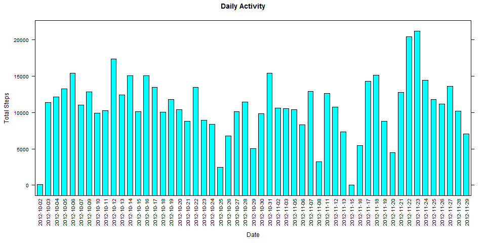
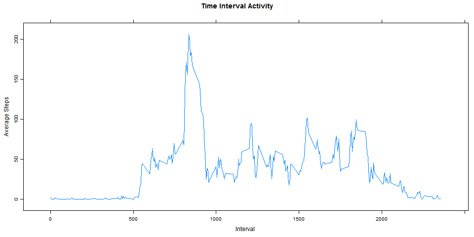
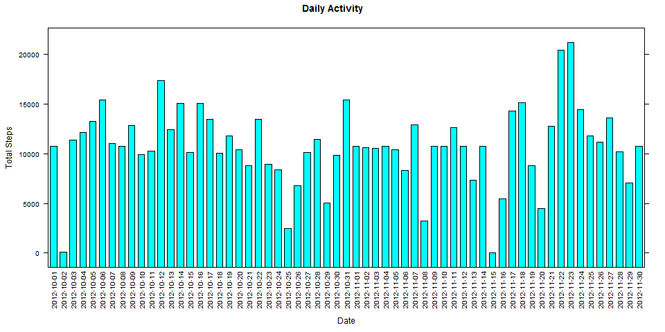
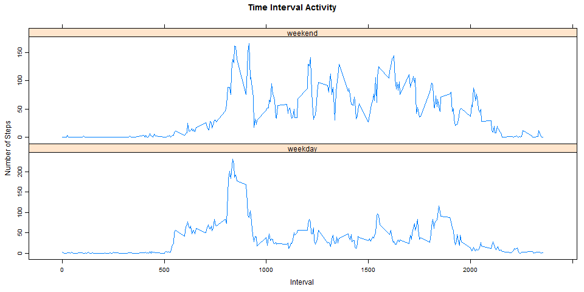

# Reproducible Research: Peer Assessment 1

## Prepare for analyses

```r
library(knitr)
library(markdown)
library(reshape)
library(plyr)
library(ggplot2)
library(lattice)
```

## What is mean total number of steps taken per day?

```r
q1 <- function() {
    
    ## Load complete cases only
    activity <- read.csv("activity.csv")
    activity <- activity[complete.cases(activity), ]
    
    ## Get the average for the set of intervals
    activity_totals <- aggregate(steps ~ date, data = activity, sum)
    
    ## Make a histogram of the total number of steps taken each day
    
    png(filename = "figures/plot_q1.png", width = 960, height = 480)
    plot_q1 <- barchart(steps ~ date, data = activity_totals, scales = list(x = list(rot = 90, 
        cex = 0.8)), main = "Daily Activity", ylab = "Total Steps", xlab = "Date")
    
    print(plot_q1)
    dev.off()
    
    ## Calculate and report the mean and median total number of steps taken per
    ## day
    
    avg_steps <- mean(activity_totals$steps, na.rm = TRUE)
    med_steps <- median(activity_totals$steps, na.rm = TRUE)
    
    message("Daily activity (steps)")
    message("Period: [", activity_totals$date[1], ",", activity_totals$date[nrow(activity_totals)], 
        "]")
    message("Mean  : ", round(avg_steps, 2))
    message("Median: ", round(med_steps, 2))
    
    
}

q1()
```

```
## Daily activity (steps)
## Period: [2012-10-02,2012-11-29]
## Mean  : 10766.19
## Median: 10765
```





## What is the average daily activity pattern?


```r
q2 <- function() {
    
    ## Load complete cases only
    activity <- read.csv("activity.csv")
    activity <- activity[complete.cases(activity), ]
    
    ## Get the average for the set of intervals
    interval_avg <- aggregate(steps ~ interval, data = activity, mean)
    
    ## 1. Make a time series plot (i.e. type = 'l') of the 5-minute interval
    ## (x-axis) and the average number of steps taken, averaged across all days
    ## (y-axis)
    
    png(filename = "figures/plot_q2.png", width = 960, height = 480)
    plot_q2 <- xyplot(interval_avg$steps ~ interval_avg$interval, type = "l", 
        scales = list(y = list(relation = "free")), main = "Time Interval Activity", 
        ylab = "Average Steps", xlab = "Interval")
    print(plot_q2)
    dev.off()
    
    # 2. Which 5-minute interval, on average across all the days in the dataset,
    # contains the maximum number of steps?
    
    message("Time interval with the maximum number of steps:")
    interval_avg <- as.data.frame(interval_avg)
    message(interval_avg[interval_avg$steps == max(interval_avg$steps), ]$interval)
    
}

q2()
```

```
## Time interval with the maximum number of steps:
## 835
```




## Imputing missing values


```r

q3 <- function() {
    
    ## Load data
    activity <- read.csv("activity.csv")
    
    ## 1. Calculate and report the total number of missing values in the dataset
    ## (i.e. the total number of rows with NAs)
    
    message("Activity data")
    message("Total observations :", nrow(activity))
    message("Missing Values     :", nrow(activity[!complete.cases(activity), 
        ]))
    message("")
    
    ## Get the average for the set of intervals
    activity_totals <- aggregate(steps ~ date, data = activity, sum)
    
    ## 2. Devise a strategy for filling in all of the missing values in the
    ## dataset.  -> mean for the corresponding 5-minute interval
    
    
    ## Get the average for the set of intervals
    interval_avg <- aggregate(steps ~ interval, data = activity, mean)
    
    ## 3. Create a new dataset that is equal to the original dataset but with the
    ## missing data filled in.  Recode NA's with the corresponding interval
    ## average
    activity$steps[interval_avg$interval %in% activity$interval] <- ifelse(is.na(activity$steps), 
        interval_avg$steps, activity$steps)
    
    ## Get the average for the set of intervals
    activity_totals <- aggregate(steps ~ date, data = activity, sum)
    
    ## Make a histogram of the total number of steps taken each day and Calculate
    ## and report the mean and median total number of steps taken per day. Do
    ## these values differ from the estimates from the first part of the
    ## assignment? What is the impact of imputing missing data on the estimates
    ## of the total daily number of steps?
    
    png(filename = "figures/plot_q3.png", width = 960, height = 480)
    plot_q3 <- barchart(steps ~ date, data = activity_totals, scales = list(x = list(rot = 90, 
        cex = 0.8)), main = "Daily Activity", ylab = "Total Steps", xlab = "Date")
    
    print(plot_q3)
    dev.off()
    
    ## Calculate and report the mean and median total number of steps taken per
    ## day
    
    avg_steps <- mean(activity_totals$steps, na.rm = TRUE)
    med_steps <- median(activity_totals$steps, na.rm = TRUE)
    
    message("Daily activity (steps)")
    message("Period: [", activity_totals$date[1], ",", activity_totals$date[nrow(activity_totals)], 
        "]")
    message("Mean  : ", round(avg_steps, 2))
    message("Median: ", round(med_steps, 2))
    
}

q3()
```

```
## Activity data
## Total observations :17568
## Missing Values     :2304
## 
## Daily activity (steps)
## Period: [2012-10-01,2012-11-30]
## Mean  : 10766.19
## Median: 10766.19
```




## Are there differences in activity patterns between weekdays and weekends?


```r


q4 <- function() {
    
    activity <- read.csv("activity.csv")
    
    ## Create a new factor variable in the dataset with two levels - 'weekday'
    ## and 'weekend' indicating whether a given date is a weekday or weekend day.
    
    activity$date <- as.Date(activity$date)
    activity$day_type <- ifelse(weekdays(activity$date) == "Saturday" | weekdays(activity$date) == 
        "Sunday", "weekend", "weekday")
    
    ## Use the dataset with the filled-in missing values for this part.
    
    ## Get the average for the set of intervals
    interval_avg <- aggregate(steps ~ interval, data = activity, mean)
    
    ## Recode NA's with the corresponding interval average
    activity$steps[interval_avg$interval %in% activity$interval] <- ifelse(is.na(activity$steps), 
        interval_avg$steps, activity$steps)
    
    ## get interval averages during weekends
    activity_we <- aggregate(steps ~ interval, data = activity[activity$day_type == 
        "weekend", ], mean)
    activity_we$day_type <- "weekend"
    
    ## get interval averages during weekdays
    activity_wd <- aggregate(steps ~ interval, data = activity[activity$day_type == 
        "weekday", ], mean)
    activity_wd$day_type <- "weekday"
    
    ## stack data into a single data frame
    activity_panel <- rbind(activity_we, activity_wd)
    activity_panel
    
    ## plot
    png(filename = "figures/plot_q4.png", width = 960, height = 480)
    plot_q4 <- xyplot(activity_panel$steps ~ activity_panel$interval | activity_panel$day_type, 
        type = "l", scales = list(y = list(relation = "free")), main = "Time Interval Activity", 
        ylab = "Number of Steps", xlab = "Interval", layout = c(1, 2))
    print(plot_q4)
    dev.off()
    
    ## Calculate and report the mean and median total number of steps taken per
    ## day
    
    avg_steps <- cbind(mean(activity_panel$steps[activity_panel$day_type == 
        "weekend"], na.rm = TRUE), mean(activity_panel$steps[activity_panel$day_type == 
        "weekday"], na.rm = TRUE))
    
    med_steps <- cbind(median(activity_panel$steps[activity_panel$day_type == 
        "weekend"], na.rm = TRUE), median(activity_panel$steps[activity_panel$day_type == 
        "weekday"], na.rm = TRUE))
    
    stats_table <- data.frame(rbind(avg_steps, med_steps))
    names(stats_table) <- c("weekend", "weekday")
    rownames(stats_table) <- c("mean", "median")
    
    message("Activity stats (steps)")
    message("Period: [", activity$date[1], ",", activity$date[nrow(activity)], 
        "]")
    stats_table
    
    
    
}

q4()
```

```
## Activity stats (steps)
## Period: [2012-10-01,2012-11-30]
```

```
##        weekend weekday
## mean     42.37   35.61
## median   32.34   25.80
```

```r

```





